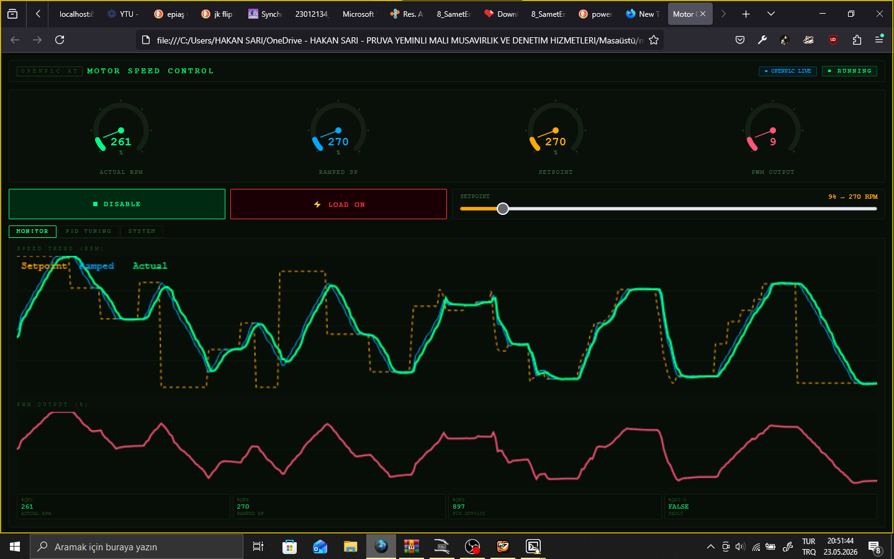
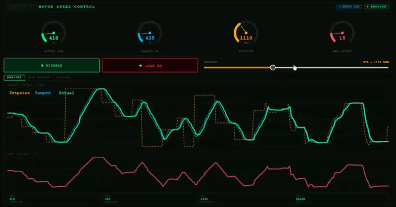
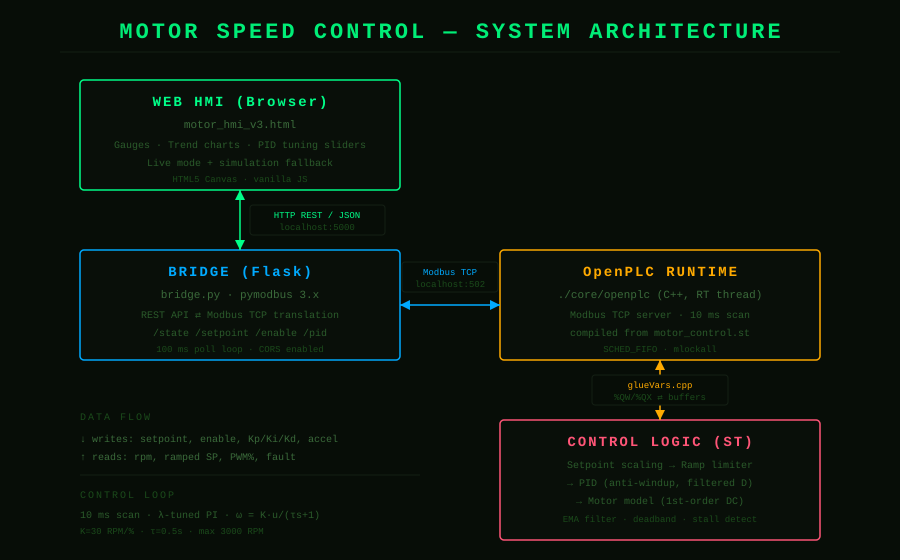
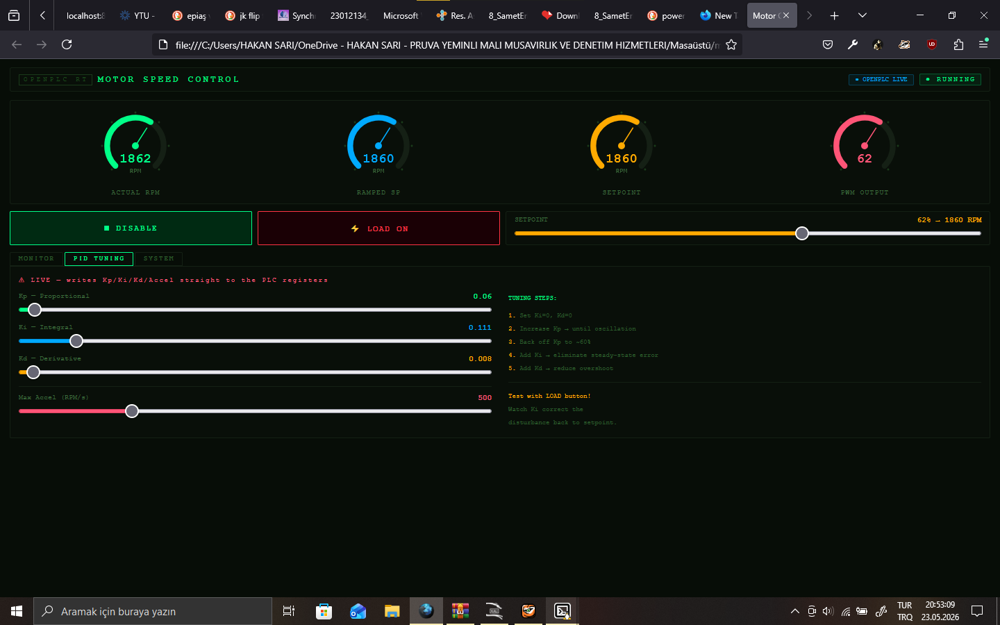
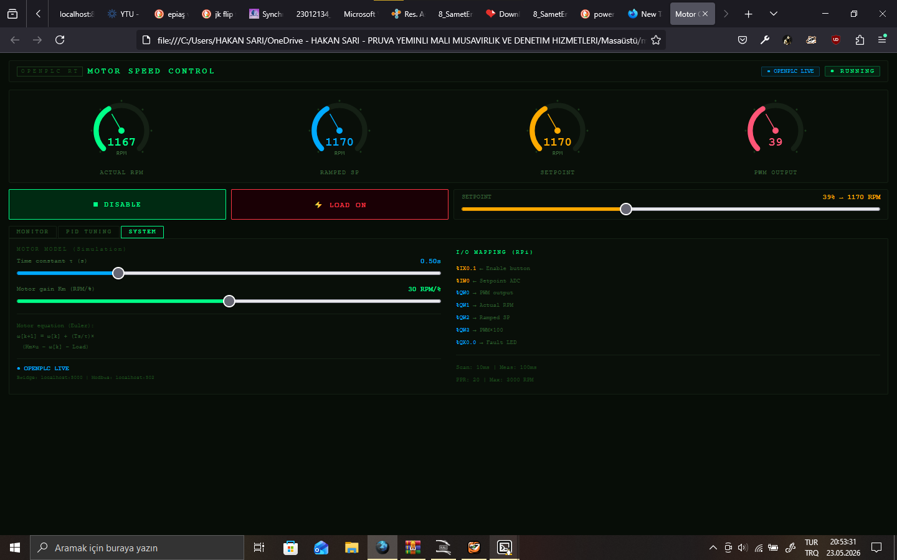

# PMDC Motor PID Speed Control — OpenPLC + Modbus + Web HMI

A closed-loop PMDC motor speed controller built on [OpenPLC](https://github.com/thiagoralves/OpenPLC_v3),
with a Python bridge exposing the runtime over REST and a browser-based HMI for live
monitoring and PID tuning. The motor itself is simulated *inside* the PLC, so the whole
control loop — plant, controller, and operator interface — runs as one self-contained system.

Built as a learning project to understand the full stack: **Modbus, HMI design, PLC
programming (IEC 61131-3 Structured Text), and PID control**.



*Live demo — setpoint changes, ramp-limited tracking, and disturbance rejection:*



## What it does

- A first-order PMDC motor model runs in Structured Text on the OpenPLC runtime.
- A **PI controller** (lambda-tuned, with anti-windup and a filtered derivative term)
  regulates the simulated motor speed toward an operator setpoint.
- A **ramp limiter** smooths the setpoint so the controller never sees a step input —
  the operator can move the slider as fast as they like and the motor follows at a safe rate.
- A **Flask bridge** translates between the HMI's REST/JSON calls and the runtime's
  Modbus TCP registers.
- A **web HMI** shows live gauges and trend charts, and lets you retune Kp/Ki/Kd and the
  ramp rate *while the motor is running* — the values are written straight into PLC registers.
- The HMI also runs a JavaScript copy of the same control loop, so it stays useful as a
  **simulation** even when the bridge/PLC isn't connected.

## Architecture



```
Web HMI  ──HTTP/JSON (5000)──►  Bridge  ──Modbus TCP (502)──►  OpenPLC runtime  ──►  ST control logic
  (browser)                     (Flask)                        (C++ binary)          (PID + motor model)
```

Four layers, three boundaries. Each boundary speaks a different protocol, and getting
them to agree on a shared address map is most of the work.

## Control design

The plant is a first-order PMDC motor:

```
τ · dω/dt + ω = K · u          K = 30 RPM/%PWM,  τ = 0.5 s,  ω_max = 3000 RPM
```

discretised with forward Euler at a 10 ms scan time.

The controller is tuned with **lambda (IMC) tuning** rather than trial-and-error. For a
first-order plant `G(s) = K/(τs+1)`, a PI controller gives a first-order *closed* loop —
which by construction has no overshoot. The single design knob is λ, the closed-loop time
constant:

```
Kp = τ / (K · λ)        Ti = τ        (Ki = Kp / Ti in the code's integral form)
```

With λ = 0.3 s (balanced, slightly brisk) the defaults come out to roughly
`Kp = 0.056`, `Ki = 0.111`, `Kd = 0.008`.

The PID block includes several practical refinements beyond the textbook form:

- **Conditional-integration anti-windup** — the integral only accumulates while the PWM
  output is unsaturated, so it can't wind up against the 0–100 % limit.
- **Filtered derivative on measurement** — the derivative acts on the (filtered) measured
  speed, not on the error, which eliminates the "derivative kick" when the setpoint jumps.
- **EMA measurement filter** — a single-pole low-pass on the speed feedback removes
  step-to-step numerical noise before it reaches the controller.
- **Deadband** — inside ±3 RPM the integral is frozen, so the output sits perfectly still
  at steady state.
- **Stall detection** — a `TON` timer raises a fault and cuts PWM if the motor fails to
  spin while commanded to.

## Register map

This table is the contract between the HMI/bridge and the PLC. All three layers must agree on it.

| ST variable      | IEC address | Modbus register | Direction | Scaling   |
|------------------|-------------|-----------------|-----------|-----------|
| `pwm_output`     | `%QW0`      | Holding reg 0   | PLC → HMI | direct    |
| `display_rpm`    | `%QW1`      | Holding reg 1   | PLC → HMI | direct    |
| `display_target` | `%QW2`      | Holding reg 2   | PLC → HMI | direct    |
| `display_pid_out`| `%QW3`      | Holding reg 3   | PLC → HMI | × 100     |
| `setpoint_raw`   | `%QW4`      | Holding reg 4   | HMI → PLC | 0–32767   |
| `kp_raw`         | `%QW5`      | Holding reg 5   | HMI → PLC | × 1000    |
| `ki_raw`         | `%QW6`      | Holding reg 6   | HMI → PLC | × 1000    |
| `kd_raw`         | `%QW7`      | Holding reg 7   | HMI → PLC | × 1000    |
| `accel_raw`      | `%QW8`      | Holding reg 8   | HMI → PLC | direct    |
| `fault_led`      | `%QX0.0`    | Coil 0          | PLC → HMI | bool      |
| `enable_btn`     | `%QX0.1`    | Coil 1          | HMI → PLC | bool      |

REAL parameters (Kp/Ki/Kd) are carried as integers scaled ×1000, since Modbus registers are
16-bit integers. The HMI multiplies before sending; the PLC divides on read.

## Repository layout

```
.
├── plc/
│   └── motor_control.st       IEC 61131-3 Structured Text — the control program
├── bridge/
│   └── bridge.py              Flask + pymodbus REST↔Modbus bridge
├── hmi/
│   └── motor_hmi_v3.html      Self-contained web HMI (no build step)
├── docs/
│   ├── architecture.svg
│   └── screenshot.png
├── requirements.txt
└── README.md
```

## Setup

> Tested on Kali Linux under WSL2 with Python 3.13. OpenPLC v3 is a prerequisite — this
> repo contains only the application code that runs *on top of* it.

### 1. Install OpenPLC v3

Follow the upstream instructions at https://github.com/thiagoralves/OpenPLC_v3.
After install, the runtime lives under `~/OpenPLC_v3/webserver/`.

### 2. Load the control program

Copy the ST file into OpenPLC's program folder, then compile it:

```bash
cp plc/motor_control.st ~/OpenPLC_v3/webserver/st_files/
cd ~/OpenPLC_v3/webserver
./scripts/compile_program.sh motor_control.st
```

Wait for `Compilation finished successfully!`. (Or upload it via the web UI:
**Programs → Upload Program**, then **Launch program**.)

### 3. Start the runtime

```bash
cd ~/OpenPLC_v3
sudo ./start_openplc.sh
```

`sudo` is needed on WSL2 for real-time scheduling (`SCHED_FIFO`, `mlockall`) and to bind
port 502. The dashboard is at http://localhost:8080.

### 4. Run the bridge

The bridge needs **pymodbus 3.x**, which is newer than the 2.5.3 that OpenPLC pins — so it
gets its own virtual environment to avoid breaking the runtime's web server:

```bash
python3 -m venv bridge-venv
./bridge-venv/bin/pip install -r requirements.txt
./bridge-venv/bin/python bridge/bridge.py
```

You should see `Connected to OpenPLC on localhost:502`.

### 5. Open the HMI

Open `hmi/motor_hmi_v3.html` in a browser. When the bridge is reachable the badge reads
`OPENPLC LIVE`; otherwise it falls back to `SIMULATION` mode.

## Usage

1. Press **ENABLE** (the motor won't turn on a setpoint alone — enable is a separate safety gate).
2. Drag the **SETPOINT** slider; watch the actual speed ramp up to track it.
3. Open the **PID TUNING** tab and move Kp/Ki/Kd or the accel limit — changes take effect
   on the next scan. Try cranking Kp up to see oscillation, or Ki to zero to see steady-state
   error return.
4. Toggle **LOAD ON** to inject a disturbance and watch the controller reject it.

PID changes made in the HMI live in PLC RAM only; they reset to the values baked into
`motor_control.st` on restart. Once you find values you like, edit the initial values in the
ST file and recompile to make them the new defaults.

| PID tuning tab | System / motor model tab |
|----------------|--------------------------|
|  |  |


## Common issues

These are the walls hit while building this — documented so you don't have to.

- **Dashboard says "Running" but your code never executes.** OpenPLC v3 compiles the ST
  program *into* the `./core/openplc` binary. `Start PLC` does not recompile — it just runs
  whatever binary is on disk. After any `.st` change you must recompile (Launch program /
  `compile_program.sh`) **and** Stop/Start the runtime. Verify with
  `strings core/openplc | grep <a_variable_name>`.

- **`cannot import name 'ModbusTcpClient'`.** The bridge uses pymodbus 3.x; OpenPLC's venv
  has 2.5.3. Keep them in separate virtual environments (see setup step 4).

- **`error: invalid located variable declaration`.** MatIEC (OpenPLC's ST compiler) dislikes
  mixing located (`AT %QW0`) and unlocated variables in the same `VAR` block. Keep them in
  two separate `VAR ... END_VAR` blocks.

- **Bridge connects but writes do nothing.** The ST address map and the bridge's register
  map have drifted apart. The bridge's header comment is the source of truth — make the ST
  `AT %…` addresses match it.

- **Runtime won't die / respawns after kill.** OpenPLC installs a `systemd` service that
  restarts it. `sudo systemctl stop openplc && sudo systemctl disable openplc`.

- **Steady-state oscillation.** Usually the derivative term amplifying feedback noise. The
  filtered-derivative-on-measurement + EMA filter + deadband in this program address it; if
  you re-tune, keep Kd small.

- **Steady-state error that never closes.** The integral limit is too low to supply the
  steady-state output. Size `INTEGRAL_LIMIT` so `Ki × limit` can reach 100 % PWM on its own.

## Notes & limitations

- The motor is *simulated in the PLC*. To drive real hardware, replace Block 1 (the motor
  model) with reads from an encoder/ADC and route `pwm_output` to a real PWM channel.
- OpenPLC v3 is end-of-life; a v4 runtime exists with dynamic program loading. This project
  targets v3.
- WSL2 can add scheduling jitter; the 10 ms scan may occasionally stretch. Fine for this
  loop, not for hard real-time control.

## License

Apache-2.0 — see [LICENSE](LICENSE). OpenPLC itself is GPLv3 and is not included here.
